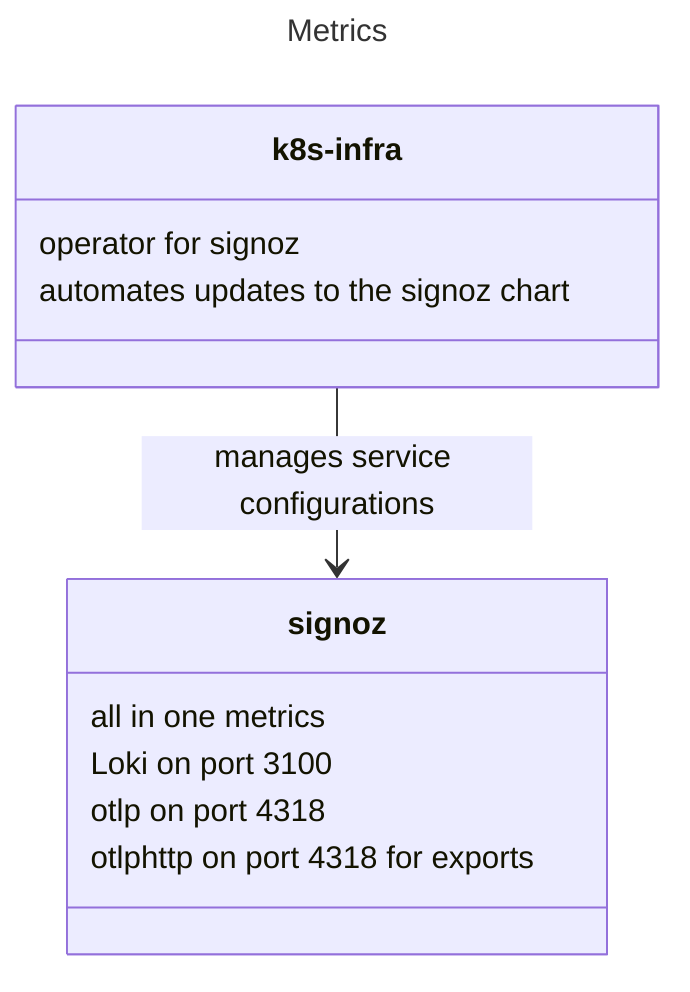

# Metrics

Metrics server will be signoz because grafana is too heavy

```mermaid
---
title: Metrics
---
classDiagram
   k8s-infra
   signoz
   k8s-infra --> signoz : manages service configurations
   
   class k8s-infra {
       operator for signoz
       automates updates to the signoz chart
   }
   class signoz {
       all in one metrics
       Loki on port 3100
       otlp on port 4318
       otlphttp on port 4318 for exports
  }

```
