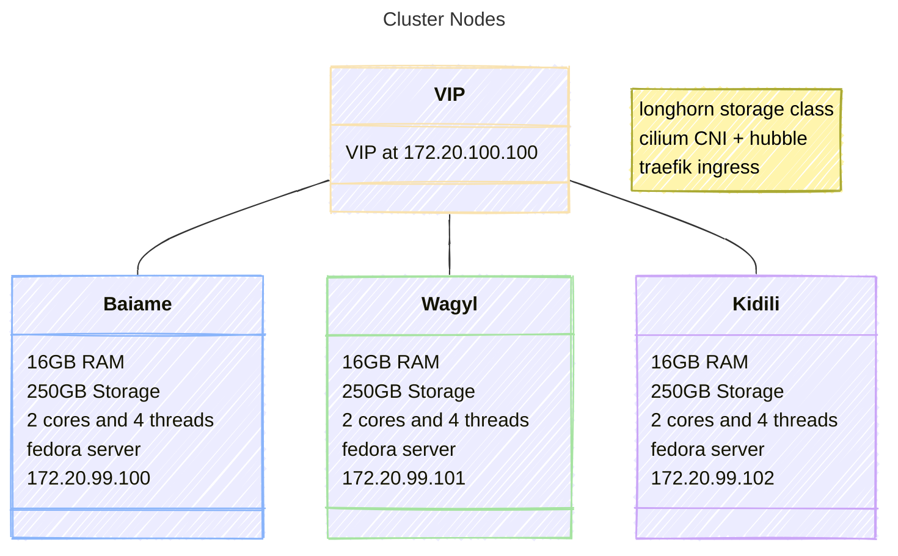

# Cluster Nodes

```mermaid
---
title: Cluster Nodes
config:
  look: handDrawn
  themeVariables:
      background: #1e1e2e
      primaryColor: #313244
      primaryTextColor: #cdd6f4
      primaryBorderColor: #cba6f7
      lineColor: #6c7086
      secondaryColor: #45475a
      tertiaryColor: #181825
      edgeLabelBackground: #1e1e2e
      clusterBkg: #181825
      clusterBorder: #45475a
      titleColor: #f5c2e7
      nodeBorder: #cba6f7
      mainBkg: #313244
      nodeTextColor: #cdd6f4
      noteBkgColor: #cdd6f4
      noteBorderColor: #cdd6f4
      cScale0: #89b4fa    # Blue
      cScale1: #cba6f7    # Mauve
      cScale2: #a6e3a1    # Green
      cScale3: #f9e2af    # Yellow
      cScale4: #fab387    # Peach
      cScale5: #f38ba8    # Red
      cScale6: #eba0ac    # Maroon
      cScale7: #94e2d5    # Teal
---
classDiagram
   Baiame
   Wagyl
   Kidili
   VIP 
   VIP -- Baiame
   VIP -- Wagyl
   VIP -- Kidili
   note "longhorn storage class <br>cilium CNI + hubble<br>traefik ingress"

   class Baiame {
       16GB RAM
       250GB Storage
       2 cores and 4 threads
       fedora server
       172.20.99.100
   }
   class Wagyl {
       16GB RAM
       250GB Storage
       2 cores and 4 threads
       fedora server
       172.20.99.101
   }
   class Kidili {
       16GB RAM
       250GB Storage
       2 cores and 4 threads
       fedora server
       172.20.99.102
   }
   class VIP {
       VIP at 172.20.100.100
   }
  style Baiame stroke:#89b4fa
  style Wagyl  stroke:#a6e3a1
  style Kidili stroke:#cba6f7
  style VIP    stroke:#f9e2af


```

