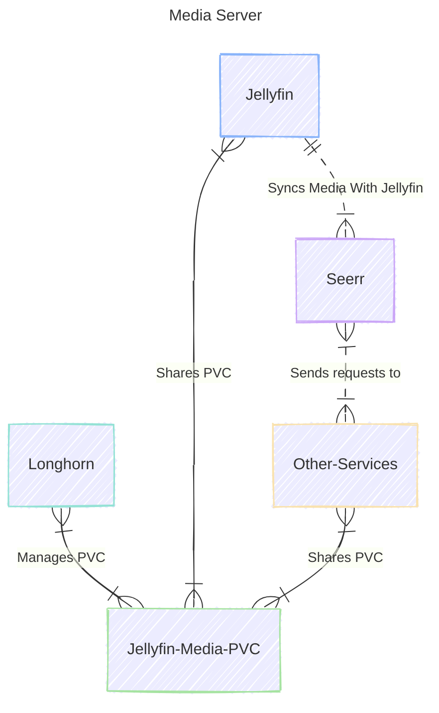

```mermaid
---
title: Media Server
config:
  look: handDrawn
  themeVariables:
      background: #1e1e2e
      primaryColor: #313244
      primaryTextColor: #cdd6f4
      primaryBorderColor: #cba6f7
      lineColor: #6c7086
      secondaryColor: #45475a
      tertiaryColor: #181825
      edgeLabelBackground: #1e1e2e
      clusterBkg: #181825
      clusterBorder: #45475a
      titleColor: #f5c2e7
      nodeBorder: #cba6f7
      mainBkg: #313244
      nodeTextColor: #cdd6f4
      cScale0: #89b4fa    # Blue
      cScale1: #cba6f7    # Mauve
      cScale2: #a6e3a1    # Green
      cScale3: #f9e2af    # Yellow
      cScale4: #fab387    # Peach
      cScale5: #f38ba8    # Red
      cScale6: #eba0ac    # Maroon
      cScale7: #94e2d5    # Teal

---
erDiagram
          Longhorn }|--|{Jellyfin-Media-PVC : "Manages PVC"
          Jellyfin }|--|{Jellyfin-Media-PVC : "Shares PVC"
          Jellyfin ||..|{Seerr : "Syncs Media With Jellyfin"
          Seerr }|..|{Other-Services : "Sends requests to"
          Other-Services }|--|{Jellyfin-Media-PVC : "Shares PVC"

          style Longhorn stroke:#94e2d5
          style Jellyfin stroke:#89b4fa
          style Jellyfin-Media-PVC stroke:#a6e3a1
          style Seerr stroke:#cba6f7
          style Other-Services stroke:#f9e2af

```
