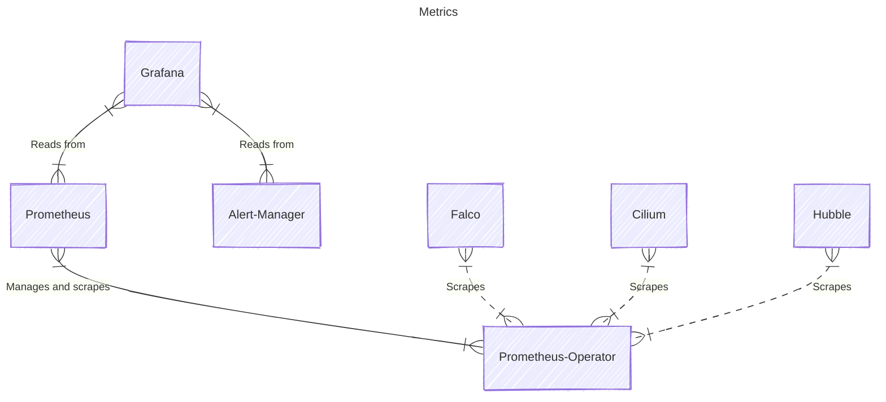

# Metrics

Metrics server will be grafana and the kubestack

```mermaid
---
title: Metrics
config:
  look: handDrawn
  themeVariables:
      background: #1e1e2e
      primaryColor: #313244
      primaryTextColor: #cdd6f4
      primaryBorderColor: #cba6f7
      lineColor: #6c7086
      secondaryColor: #45475a
      tertiaryColor: #181825
      edgeLabelBackground: #1e1e2e
      clusterBkg: #181825
      clusterBorder: #45475a
      titleColor: #f5c2e7
      nodeBorder: #cba6f7
      mainBkg: #313244
      nodeTextColor: #cdd6f4
      cScale0: #89b4fa    # Blue
      cScale1: #cba6f7    # Mauve
      cScale2: #a6e3a1    # Green
      cScale3: #f9e2af    # Yellow
      cScale4: #fab387    # Peach
      cScale5: #f38ba8    # Red
      cScale6: #eba0ac    # Maroon
      cScale7: #94e2d5    # Teal
---
erDiagram
      Grafana}|--|{Prometheus : "Reads from"
      Prometheus }|--|{Prometheus-Operator : "Manages and scrapes"
      Grafana}|--|{ Alert-Manager : "Reads from"
      Falco}|..|{Prometheus-Operator : "Scrapes"
      Cilium}|..|{Prometheus-Operator : "Scrapes"
      Hubble}|..|{Prometheus-Operator : "Scrapes"
      


```
